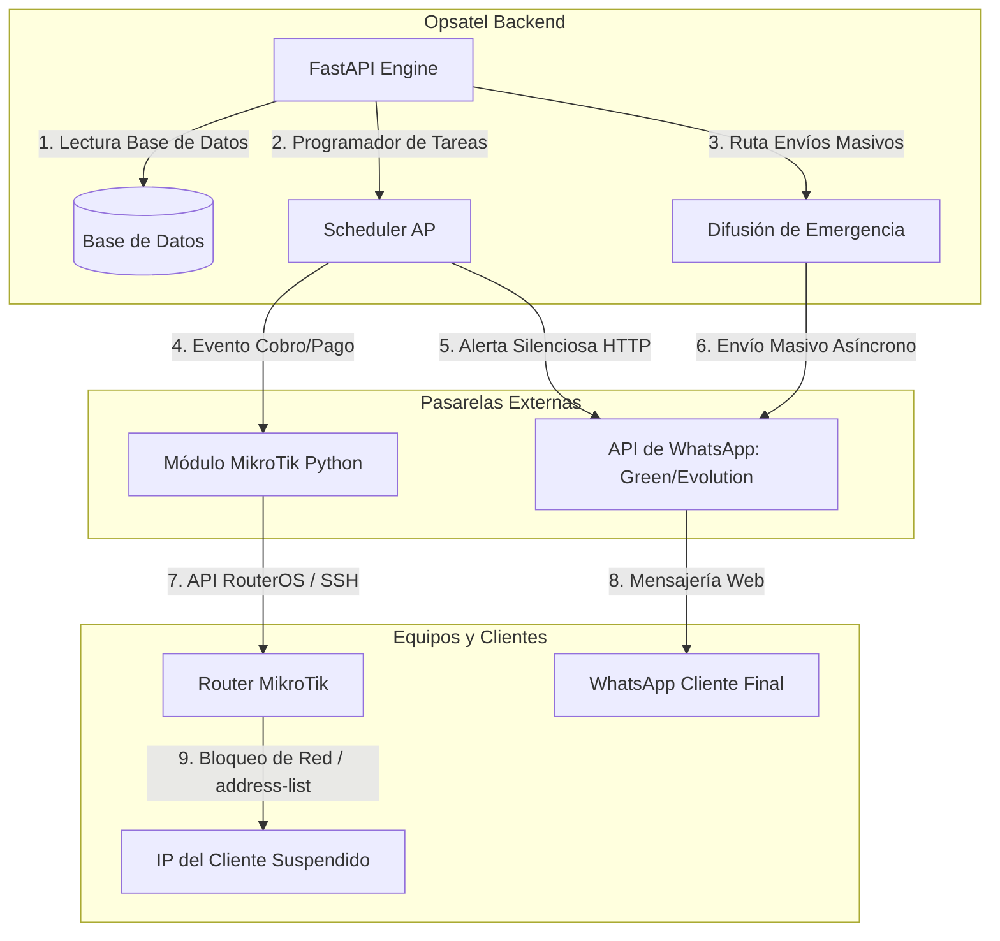

# Plan de Implementación: Automatización de WhatsApp API, Difusión de Emergencia & MikroTik

Este documento detalla el plan de diseño y desarrollo paso a paso para transformar **Opsatel** en un gestor automatizado e inteligente para tu ISP, integrando envíos silenciosos de WhatsApp, un Centro de Difusiones Globales en caso de emergencias, y la administración automatizada de tus routers MikroTik.

> [!IMPORTANT]
> **Nota de Control:** Este es un documento de planificación técnica. **Ningún cambio de código será aplicado todavía** en tus repositorios de Backend o Frontend hasta que revises este plan y des tu aprobación.

---

## 🛠️ Arquitectura de la Solución



---

## 📅 Fase 1: Pasarela de WhatsApp Silenciosa & Difusión Masiva de Emergencia

El objetivo es lograr envíos masivos instantáneos en segundo plano y crear un canal directo de comunicación rápida con tus clientes en caso de caídas de nodos, cortes de energía o mantenimiento general.

### Pasos Técnicos:
1. **Selección del API Gateway**:
   * Usaremos **Green API** (cuenta con capa gratuita robusta para pruebas) o un contenedor docker auto-alojado de **Evolution API**.
2. **Esquema de Credenciales**:
   * Agregaremos variables en el archivo `.env` del Backend:
     ```bash
     WHATSAPP_API_URL=https://api.green-api.com
     WHATSAPP_INSTANCE_ID=tu_instancia_aqui
     WHATSAPP_TOKEN=tu_token_aqui
     ```
3. **Refactorización del Módulo de WhatsApp en Backend**:
   * Sustituir `pywhatkit` en `routes/whatsapp.py` y `scheduler.py` con una petición HTTP asíncrona segura (`httpx` o `requests`).
4. **Endpoint de Envíos Masivos de Emergencia (`POST /whatsapp/enviar-global`)**:
   * Crearemos una ruta dedicada en el backend que:
     1. Obtenga la lista completa de todos los clientes activos con número telefónico registrado.
     2. Redacte el mensaje de emergencia ingresado por el administrador.
     3. Utilice programación asíncrona (`BackgroundTasks` de FastAPI) para realizar el envío masivo en paralelo a todos los destinatarios sin bloquear el servidor.
     4. Registre los envíos en el historial identificados con la etiqueta `🚨 Emergencia`.

---

## 📅 Fase 2: Módulo de Conexión y Gestión de MikroTik

Permitirá que Opsatel se comunique directamente con tus equipos MikroTik para ejecutar comandos de control de tráfico.

### Pasos Técnicos:
1. **Actualización del Modelo de Base de Datos (`models.py`)**:
   * Crearemos la tabla `MikrotikNodo` para almacenar las credenciales de tus routers:
     ```python
     class MikrotikNodo(Base):
         __tablename__ = "mikrotik_nodos"
         id = Column(Integer, primary_key=True)
         nombre = Column(String(100), nullable=False)
         ip = Column(String(50), nullable=False)
         puerto_api = Column(Integer, default=8728)
         usuario = Column(String(100), nullable=False)
         password = Column(String(100), nullable=False)
         activo = Column(Boolean, default=True)
     ```
2. **Instalación de Dependencias**:
   * Integraremos la librería `routeros-api` (para RouterOS v6/v7) en `requirements.txt`.
3. **Módulo de Servicio MikroTik (`services/mikrotik.py`)**:
   * Crearemos un conector centralizado con funciones clave:
     * `cortar_servicio_cliente(ip, mac, tipo_corte)`: Agrega la IP al `address-list="Corte_Opsatel"` en el Firewall o deshabilita la Queue.
     * `activar_servicio_cliente(ip, mac)`: Elimina la IP de la lista de corte y reactiva su Queue normal de navegación.
     * `cambiar_velocidad_cliente(nombre_queue, limite_subida, limite_bajada)`: Modifica las colas simples (Simple Queues) del MikroTik en tiempo real.

---

## 📅 Fase 3: Integración de Flujos Automatizados de ISP (WispHub Style)

En esta fase uniremos ambos mundos (Finanzas, MikroTik y WhatsApp) para lograr automatización total.

### Pasos Técnicos:
1. **Trigger de Corte Automático (El día configurado de cobro)**:
   * A la hora de corte programada, el `scheduler.py` buscará los clientes con pagos pendientes.
   * Por cada cliente pendiente:
     1. Conectará al MikroTik correspondiente y **aplicará el corte de internet**.
     2. Disparará un WhatsApp con el mensaje: *"Estimado cliente, su servicio ha sido suspendido temporalmente por pago pendiente. Saldo a pagar: $XX."*
2. **Trigger de Reconexión Inmediata (Al registrar el pago)**:
   * Al agregar un pago en el panel de Opsatel (Módulo Finanzas):
     1. El sistema conectará automáticamente al MikroTik y **restaurará el servicio a su velocidad original en 0.5 segundos**.
     2. Disparará un WhatsApp automático con la confirmación de pago: *"¡Gracias por su pago! Su servicio de internet ha sido reactivado automáticamente."*

---

## 📅 Fase 4: Interfaz de Usuario y Centro de Emergencia en Frontend

Diseñaremos las vistas visuales para la gestión de MikroTik y el panel de alertas globales.

### Pasos Técnicos:
1. **🚨 Módulo: Difusión de Emergencia Global (UI)**:
   * Diseñaremos una sección destacada en el **Centro de WhatsApp** que consistirá en:
     * Un editor de texto para redactar el comunicado masivo (ej: *"Corte de energía en Nodo Central, estamos trabajando en la solución..."*).
     * **Mecanismo de Doble Seguridad**: Para evitar que envíes un mensaje masivo a todos tus clientes por error al hacer un clic en falso, el botón de "Enviar Difusión" estará bloqueado. Para desbloquearlo, el administrador deberá escribir una palabra clave en un campo (ej: digitar la palabra `"EMERGENCIA"` o `"ENVIAR MASIVO"`).
     * Barra de progreso en tiempo real de los envíos en cola.
2. **Nueva Vista: Gestión de MikroTik**:
   * Panel para que agregues tus routers MikroTik (IP, usuario, contraseña) y pruebes la conexión con un botón "Ping de Conexión".
3. **Interruptores de Configuración Global**:
   * Selectores de tipo interruptor (Toggle Switches):
     * `[ON/OFF] Aplicar Corte de Internet en MikroTik automáticamente`.
     * `[ON/OFF] Enviar Notificación de WhatsApp por cobros/cortes automáticamente`.

---

## 📊 Cronograma Estimado

| Fase | Tarea Principal | Duración Estimada | Riesgo |
|---|---|---|---|
| **Fase 1** | Integración de WhatsApp API + Endpoint de Difusión Global Masiva | 2 Días | Bajo |
| **Fase 2** | Conector MikroTik de Python e infraestructura de base de datos | 2 - 3 Días | Medio |
| **Fase 3** | Lógica cruzada automatizada (Pago -> Reactivar / Deuda -> Cortar) | 2 Días | Bajo |
| **Fase 4** | Desarrollo del Panel UI en React (Gestión MikroTik + Modal de Emergencia) | 2 Días | Bajo |

---

> [!TIP]
> **Recomendación Inicial:** El módulo de **Difusión de Emergencia** se puede programar en conjunto con la **Fase 1** ya que ambos dependen de la misma API de WhatsApp silenciosa. Es una herramienta crítica para cualquier ISP para calmar llamadas de soporte en caso de averías generales.
